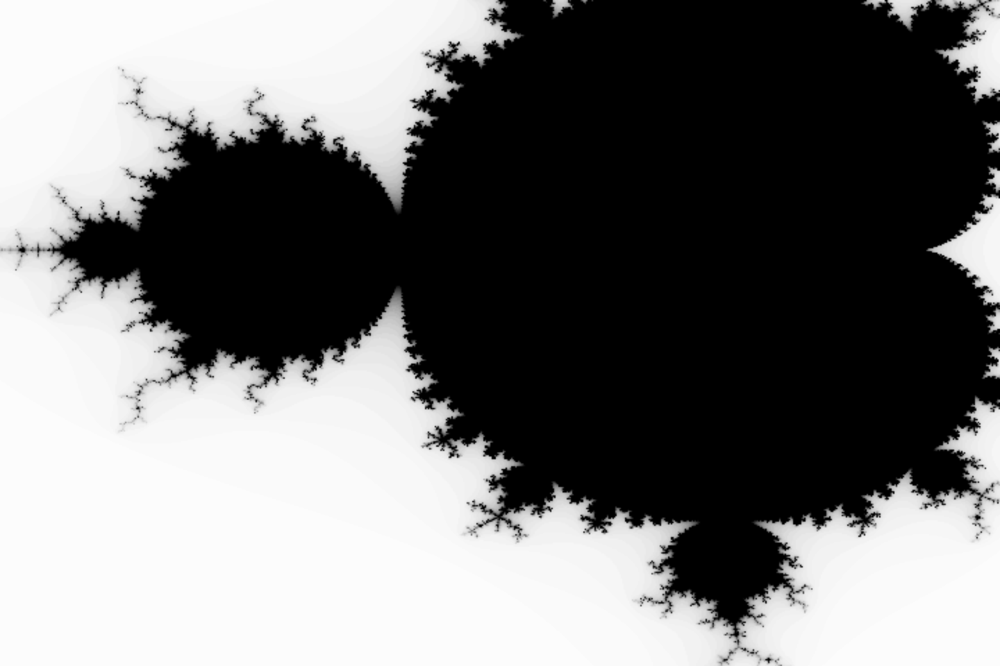

# Programming in Scala Project

Project for programming in scala course. The program draws a visualization of the Mandelbrot set and saves it as `.pgm` file.

### Details

Run "scala Mandelbrot" (in Mandelbrot folder) to use program.

Edit `params\parameters.txt` to change initial conditions.

Commands (self-explaining):

* `quit`
* `export`
* `left` - navigate
* `right`
* `up`
* `down`
* `E left`, `E right` - zoom in / zoom out
* `W left`, `W right`
* `N up`, `N down`
* `S up`, `S down`

Note: If using Linux, you may need to change folder paths form `\\` to `/`.

___

### Screenshots:

